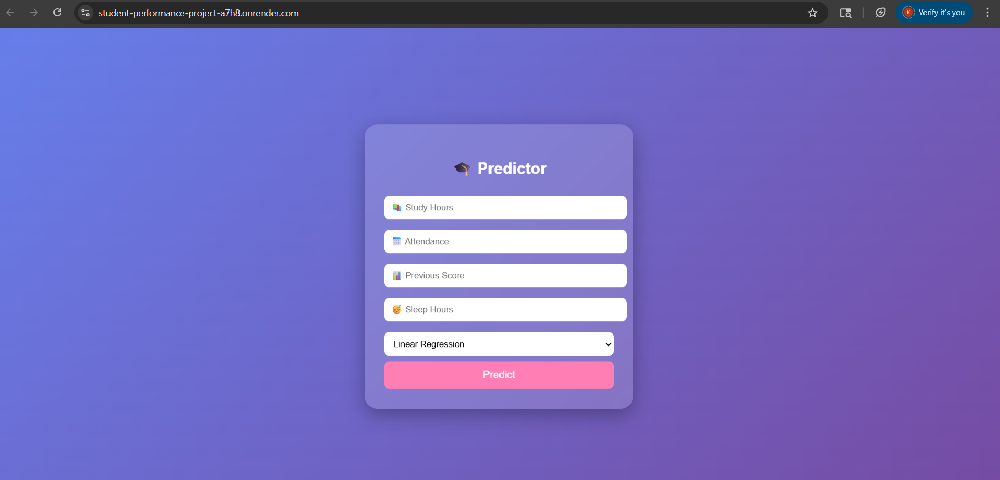
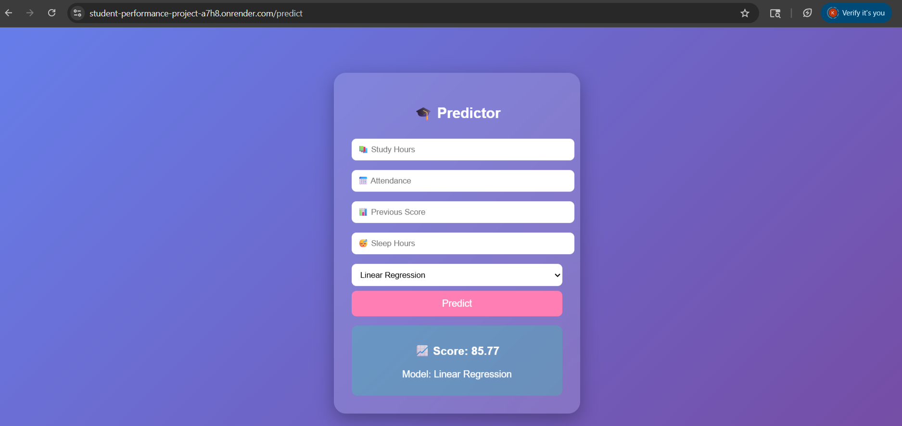

# 🎓 Student Performance Predictor

## 🚀 Live Demo
https://your-render-link

## 📌 Features
- Predict student performance using ML
- Multiple models (Linear Regression, Random Forest)
- Interactive UI with animations
- Real-time predictions

## 🛠 Tech Stack
- Python
- Flask
- Scikit-learn
- HTML/CSS

## ⚡ Run Locally
pip install -r requirements.txt  
python app.py

## 📷 Screenshot

